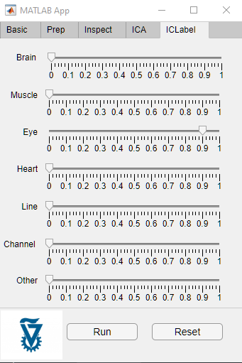
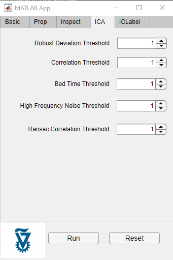
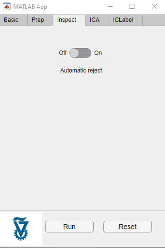
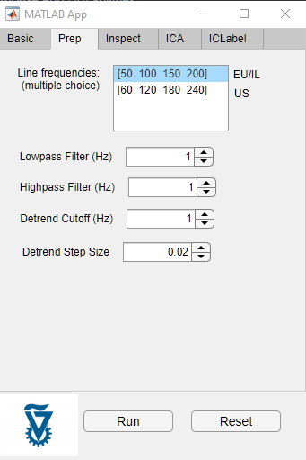
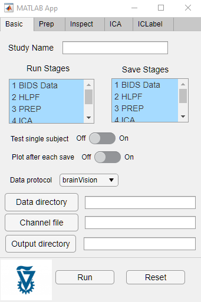

EEG Pipelines
-------------

This project purpose is to suggest an infrastructure for processing, modeling and analyzing raw EEG data relying on MatLab and EEGLAB.

To start the app GUI run:
`app1.mlapp`

EEG analysing pipeline tutorial
-------------------------------

## Workspace setup
Includes MATLAB R2020B with Parallel Computing and EEGLAB 2020_0 toolbox, EEGLAB has both GUI & Scripting abilities and has proprietary plugin manager that I use to install: 
- Adjust1.1.1
- automagic2.4.3
- bva-io1.6
- clean_rawdata
- Cleanline1.04
- dipfit
- firfilt
- ICLabel
- LIMO2.0
- loreta2.0
- MARA1.2
- PowPowCAT2.20
- PrepPipeline0.55.4
- REST1.2
- SASICA1.3.4
- SIFT1.52

Business logic is in sync with GitHub repo (without subjects data), to quickly learn how to script in EEGLAB it is recommended to use GUI and view command history by running eegh or EEG.history in terminal. There are many resources online including library of free open source EEG dataset and here, Youtube tutorials by founder and wiki page with workshops.

## EEG raw data composition

A total of 77 subjects:
2017 - 32 subjects (report claimed 24), files naming template (story/stories)_D_DDMMYY or (story/stories)_DDMMYY_D
2018 - 45 subjects (report claimed 34), files naming template
 stories_DDD_DDMMYY

Data captured by 64 channels with sampling interval in microseconds 2000, frequency is 500Hz and length of each session is about 4 minutes

If you have channels names like Fz, Cz, Pz... this naming rule is called 'international 10-5 system' which EEGLAB can find their default values according to Oostenveld and Praamstra (2001)

64Ch actiCAP snap AP-64 layout of easycap

Childerns at the age of 3-8 practice mindfulness.

Experiment can be splitted into 3 main events:

Hearing stories (30sec) marked as 11,12,13,14,15
Control hearing sounds (30sec) marked as 10
Rest marked as 3,4

Following flow format:
(Rest) Story →  (Rest) Story →  (Rest) Control →  (Rest) Story →  (Rest) Story →  (Rest) Control →  (Rest) Story 

Notice, as we can see from data, events was not marked in a consistent way

## Load raw data to EEGLAB data structure
Raw data was captured by BrainVision data files includes eeg, vhdr, vmrk
- A text header file (.vhdr) containing metadata
- A text marker file (.vmrk) containing information about events in the data
- A binary data file (.eeg) containing the voltage values of the EEG

## Citations and references
### Automagic - Standardized Preprocessing of Big EEG Data
github Paper
Pedroni, A., Bahreini, A., & Langer, N. (2019). Automagic: Standardized preprocessing of big EEG data. Neuroimage. doi: 10.1016/j.neuroimage.2019.06.046

### BEAPP - Batch EEG Automated Processing Platform 
github paper
Levin AR, Méndez Leal AS, Gabard-Durnam LJ, and O'Leary, HM. BEAPP: The Batch Electroencephalography Automated Processing Platform. Frontiers in Neuroscience (2018).

### HAPPE - The Harvard Automated Processing Pipeline for Electroencephalography
github paper
Gabard-Durnam LJ, Mendez Leal AS, Wilkinson CL and Levin AR (2018) The Harvard Automated Processing Pipeline for Electroencephalography (HAPPE): Standardized Processing Software for Developmental and High-Artifact Data. Front. Neurosci. 12:97. doi: 10.3389/fnins.2018.00097

### MADE - The Maryland analysis of developmental EEG pipeline
github Paper
The Maryland Analysis of Developmental EEG (MADE) Pipeline Ranjan Debnath, George A. Buzzell, Santiago Morales, Maureen E. Bowers, Stephanie C. Leach, Nathan A. Fox bioRxiv 2020.01.29.925271; doi: https://doi.org/10.1101/2020.01.29.925271

### PREP - pipeline for standardized preprocessing of EEG
github Paper
Bigdely-Shamlo N, Mullen T, Kothe C, Su K-M and Robbins KA (2015)
The PREP pipeline: standardized preprocessing for large-scale EEG analysis
Front. Neuroinform. 9:16. doi: 10.3389/fninf.2015.00016

### ADJUST - An automatic EEG artifact detector
github Paper
Mognon A, Jovicich J, Bruzzone L, Buiatti M. ADJUST: An automatic EEG artifact detector based on the joint use of spatial and temporal features. Psychophysiology. 2011 Feb;48(2):229-40. doi: 10.1111/j.1469-8986.2010.01061.x. PMID: 20636297.

### MARA - Multiple Artifact Rejection Algorithm
github Paper
Irene Winkler, Stephanie Brandl, Franziska Horn, Eric Waldburger, Carsten Allefeld and Michael Tangermann. Robust artifactual independent component classification for BCI practitioners. Journal of Neural Engineering, 11 035013, 2014.

### SASICA - SemiAutomatic Selection of Independent Components for Artifact correction in the EEG
github Paper
Chaumon M, Bishop DV, Busch NA. A Practical Guide to the Selection of Independent Components of the Electroencephalogram for Artifact Correction. Journal of neuroscience methods. 2015 

### FASTER - Fully automated statistical thresholding for EEG artifact rejection
github Paper
H. Nolan, R. Whelan, and R.B. Reilly. Faster: Fully automated statistical thresholding for eeg artifact rejection. Journal of Neuroscience Methods, 192(1):152-162, 2010.

### Artifact Subspace Reconstruction (ASR)

### Makoto's_preprocessing_pipeline

